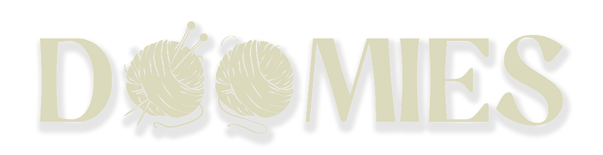

<div align="center">
  <a href="https://github.com/Big-Head-Club/bhc-dom-strategy-game">
    
  </a>
  <p align="center">
    An on-chain battle royale game inspired by <a href="https://twitter.com/dhof/status/1566823568616333316">Dom's tweet</a> and <a href="https://github.com/w1nt3r-eth/dom-strategy-game">w1nt3r-eth's code</a>.
    <br />
    <hr />
    <a href="https://doomies.xyz">Mint</a>
    ·
    <a href="https://game.doomies.xyz">Play</a>
    ·
    <a href="https://github.com/Big-Head-Club/bhc-dom-strategy-game/issues">Report Bug</a>
    <hr />
  </p>
</div>

<!-- TABLE OF CONTENTS -->
<details>
  <summary>Table of Contents</summary>
  <ol>
    <li>
      <a href="#about-the-project">About The Project</a>
      <ul>
        <li><a href="#built-with">Built With</a></li>
      </ul>
    </li>
    <li>
      <a href="#development">Development</a>
      <ul>
        <li><a href="#contracts">Contracts</a></li>
        <li><a href="#client">Client</a></li>
      </ul>
    </li>
    <li><a href="#roadmap">Roadmap</a></li>
    <li><a href="#license">License</a></li>
    <li><a href="#contact">Contact</a></li>
    <li><a href="#acknowledgments">Acknowledgments</a></li>
  </ol>
</details>

## About

[![Product Name Screen Shot][product-screenshot]](https://doomies.xyz)

Doomies is an on-chain turn-based strategy game played on a 9x9 grid. You must own a Doomie to enter the game, and a Doomie can only play the game once, regardless if you win or lose. Each Doomie can only play once and there are 16 players per game.

Since Doomies was built in a hackathon, take note that it does have many rough edges and limitations. Still, we hope you enjoy it.

### Built With

* [Hardhat][hardhat-url]
* [Ganache][ganache-url]
* [Metamask][metamask-url]
* [React][react-url]
* [Vite][vite-url]
* [Wagmi][wagmi-url]
* [Connectkit][connectkit-url]

## Development

This repo contains three folders:
1. `contracts` is where the contracts, hardhat config and tests live
2. `client` is the web2 frontend
3. `assets` contains images we use in this README, you can just ignore it

Since this is a Yarn workspace, you can run `yarn install` in the project's root and you'll have all the dependencies you need for both `contracts` and `client` - this may take a while though.
After that, follow the steps below to hack on our contracts or client.

### Contracts
0. Run `yarn install` in the repo's root.
1. In the `contracts` directory, copy `.env.template` and create a `.env` file.
```sh 
cd contracts 
cp .env.template .env
```
3. Fill those in, and choose the network you will use for development. We use `ganache`.
4. Run a local chain. You can use whatever you want, just remember to adjust the `hardhat.config.js` file accordingly. To use the project's ganache dependency, just run 
```sh 
yarn ganache
```
5. Deploy the contracts.
```sh 
yarn deploy:ganache
```
6. Start a game.
```sh 
yarn dev:start-game:ganache
```
7. At this point, you can mint doomies, join the game and have fun!

In case you want to simulate a playthrough of a game of Doomies, we've prepared `yarn dev:play:X` commands. If you run them in order, from `dev:play:1` to `dev:play:13`, that should get you to an end-game state (the game won't be over yet, though). You can also run `yarn dev:play:end` to run all those `dev:play` commands for you, or `yarn dev:play:half` to get to a mid-game state.

If you make changes to the contracts, just run `yarn compile` and that will compile the contracts and export their ABIs to the right folder in the `client` package (you can also mess around with that in `hardhat.config.js`).

### Client

0. Run `yarn install` in the repo's root.
1. In the `client` directory, copy `.env.template` and create a `.env` file.
```sh
cd client 
cp .env.template .env
```
2. Fill in your alchemy ID if you want, and the contract addresses. You can grab those at `contracts/addresses.json` (that json is generated when the contracts are compiled).
3. Run a development version with
```sh
yarn dev
```
4. (Optional) To get through all the different game stages, you'll need to follow the steps above and deploy contracts locally. Turns take 24 hours, so `yarn dev:next-turn:ganache` was written to speed things up.

## Roadmap

There is no roadmap. Take this and do with it whatever you want.

## License

Distributed under the MIT License. See `LICENSE.txt` for more information.

## Contact

Big Head Club - [@bigheadhq](https://twitter.com/bigheadhq) - officialstuff@bighead.club

## Acknowledgments

* [Dom](https://twitter.com/dhof/)
* [w1nt3r-eth](https://twitter.com/w1nt3r_eth)

<!-- https://www.markdownguide.org/basic-syntax/#reference-style-links -->
[product-screenshot]: assets/doomies.png
[hardhat-url]: https://hardhat.org/
[ganache-url]: https://trufflesuite.com/ganache/
[metamask-url]: https://metamask.io/
[react-url]: https://reactjs.org/
[vite-url]: https://vitejs.dev/
[wagmi-url]: https://wagmi.sh/ 
[connectkit-url]: https://docs.family.co/connectkit
